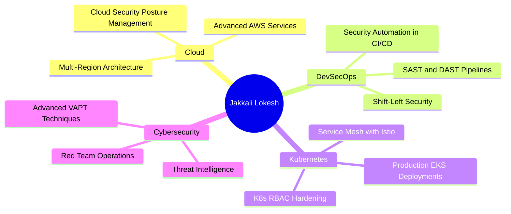

<!-- ═══════════════════════════════════════════════════════════════
  JAKKALI LOKESH · @jakkalilokesh
  Cloud Engineer | DevOps | DevSecOps | Cybersecurity
═══════════════════════════════════════════════════════════════ -->

<div align="center">

<!-- ═══════════ HEADER BANNER ═══════════════════════════════════ -->


<!-- ═══════════ MULTI-COLOR NAME SVG ══════════════════════════════
  NOTE: GitHub strips <style> blocks in inline SVGs.
  All styling must be via direct attributes on each element.
══════════════════════════════════════════════════════════════════ -->
<svg width="560" height="68" viewBox="0 0 560 68" xmlns="http://www.w3.org/2000/svg">
  <text x="14"  y="52" font-family="Courier New, monospace" font-size="40" font-weight="900" fill="#22c55e">J</text>
  <text x="45"  y="52" font-family="Courier New, monospace" font-size="40" font-weight="900" fill="#4ade80">A</text>
  <text x="76"  y="52" font-family="Courier New, monospace" font-size="40" font-weight="900" fill="#86efac">K</text>
  <text x="107" y="52" font-family="Courier New, monospace" font-size="40" font-weight="900" fill="#16a34a">K</text>
  <text x="138" y="52" font-family="Courier New, monospace" font-size="40" font-weight="900" fill="#22c55e">A</text>
  <text x="169" y="52" font-family="Courier New, monospace" font-size="40" font-weight="900" fill="#4ade80">L</text>
  <text x="196" y="52" font-family="Courier New, monospace" font-size="40" font-weight="900" fill="#86efac">I</text>
  <text x="244" y="52" font-family="Courier New, monospace" font-size="40" font-weight="900" fill="#22c55e">L</text>
  <text x="272" y="52" font-family="Courier New, monospace" font-size="40" font-weight="900" fill="#4ade80">O</text>
  <text x="308" y="52" font-family="Courier New, monospace" font-size="40" font-weight="900" fill="#86efac">K</text>
  <text x="340" y="52" font-family="Courier New, monospace" font-size="40" font-weight="900" fill="#16a34a">E</text>
  <text x="372" y="52" font-family="Courier New, monospace" font-size="40" font-weight="900" fill="#22c55e">S</text>
  <text x="404" y="52" font-family="Courier New, monospace" font-size="40" font-weight="900" fill="#4ade80">H</text>
</svg>

<!-- ═══════════ TYPING ANIMATION ════════════════════════════════ -->


<br/><br/>

<!-- ═══════════ QUICK BADGES ════════════════════════════════════ -->
<a href="https://jakkalilokesh.github.io/my_portfolio/">
  
</a>
&nbsp;
<a href="https://www.linkedin.com/in/jakkali-lokesh-a1a809211/">
  
</a>
&nbsp;

&nbsp;


</div>

<br/>

---

<!-- ═══════════════════════════════════════════════════════════════
  § 1  ABOUT ME
═══════════════════════════════════════════════════════════════ -->


### `$ whoami`

```yaml
name       : Jakkali Lokesh
handle     : @jakkalilokesh
location   : Kurnool, Andhra Pradesh, India
pronouns   : He / Him
email      : jakkalilokesh@gmail.com
portfolio  : https://jakkalilokesh.github.io/my_portfolio/
education  : B.Tech CSE @ Rayalaseema University (2023–2026) · CGPA 7.7
focus      : Cloud · DevOps · DevSecOps · Cybersecurity · SOC Analysis
bounty     : $100 Bug Bounty on Udemy (Subdomain Takeover via HackerOne)
mindset    : "Build Secure. Scale Fast. Break Things Ethically."
```

A passionate **Cloud & DevOps Engineer** and **Cybersecurity Analyst** specialising in Blue Teaming, SOC Analysis, Threat Detection & Response, and Digital Forensics. Currently pursuing a B.Tech in Computer Science Engineering at Rayalaseema University.

I design resilient cloud-native architectures on **AWS**, orchestrate containerised workloads with **Kubernetes & Docker**, and embed security at every layer of the software delivery lifecycle with **Terraform IaC**, **Jenkins**, and **GitHub Actions**.

On the offensive side, I conduct **VAPT**, participate in **Bug Bounty** programmes (earned a **$100 bounty on Udemy** for a critical Subdomain Takeover), and compete in **CTF challenges** — bridging infrastructure engineering and adversarial security to ship systems that are both fast and defensible.

```
🔭  Currently  →  AWS EKS production deployments & cloud security research
🌱  Learning   →  Advanced DevSecOps · Security Automation · Cloud-native SIEM
🏆  Achieved   →  $100 Bug Bounty (Udemy) · Hacker's Gambit CTF · Chaitanya CTF 2025
🤝  Open to    →  SOC Analyst · DevOps · Cloud · DevSecOps roles & internships
⚡  Edge       →  I think like an attacker and build like an engineer
```

<br clear="right"/>

---

<!-- ═══════════════════════════════════════════════════════════════
  § 2  EXPERIENCE
═══════════════════════════════════════════════════════════════ -->

<div align="center">

## 💼 Work Experience

</div>

<br/>

<table>
  <tr>
    <td width="50%" valign="top">

**🐛 Bug Bounty Hunter / Researcher**
**HackerOne** · Apr 2024 – Present

- Actively hunting vulnerabilities across various bug bounty platforms
- Earned **$100 bounty** for discovering a critical **Subdomain Takeover** on Udemy
- Reported valid **Broken Access Control** (OWASP A5) vulnerability
- Responsible disclosure through coordinated HackerOne reports

`Bug Bounty` `Subdomain Takeover` `Web Security` `OWASP`

  </td>
  <td width="50%" valign="top">

**🔐 Cybersecurity & Ethical Hacking (VAPT) Intern**
**SURE TRUST** · Jun 2024 – Dec 2024

- Conducted Vulnerability Assessment and Penetration Testing (VAPT)
- Worked on GRC frameworks and Digital Forensics methodologies
- Performed network reconnaissance, exploitation, and reporting

`VAPT` `GRC` `Digital Forensics` `Penetration Testing`

  </td>
  </tr>
  <tr>
  <td width="50%" valign="top">

**☁️ Cloud Computing – DevOps Intern**
**APSSDC** · May 2024 – Jul 2024

- Deployed and managed AWS services: EC2, S3, RDS, CloudFront
- Hands-on cloud infrastructure design and DevOps practices
- Implemented CI/CD workflows and cloud automation scripts

`AWS` `DevOps` `EC2` `S3` `Cloud Infrastructure`

  </td>
  <td width="50%" valign="top">

**🔒 Cyber Security Intern**
**The Red Users** · Feb 2024 – Mar 2024

- Gained foundational experience in cybersecurity operations
- Performed threat analysis and security monitoring tasks

`Cybersecurity` `Threat Analysis` `Security Operations`

  </td>
  </tr>
  <tr>
  <td width="50%" valign="top">

**☁️ Cloud Computing Engineering Intern**
**ExcelR** · Jul 2024 – Aug 2024

- Learned cloud computing fundamentals and worked on cloud-based projects
- Worked with AWS and Azure cloud platforms

`Cloud Computing` `Azure` `AWS`

  </td>
  <td width="50%" valign="top">

**🎓 Education**
**B.Tech – Computer Science Engineering**
Rayalaseema University · 2023 – 2026 · **CGPA 7.7**

**Diploma – Bio Medical Engineering**
SGPR GOVT Polytechnic College · 2019 – 2023 · **75.4%**

`CSE` `Cybersecurity` `Ethical Hacking`

  </td>
  </tr>
</table>

---

<!-- ═══════════════════════════════════════════════════════════════
  § 3  TECHNOLOGY ARSENAL
═══════════════════════════════════════════════════════════════ -->

<div align="center">

## ⚙️ Technology Arsenal

</div>

<br/>

**☁️ Cloud & AWS Services**

<div align="center">


</div>

<br/>

**🚀 DevOps & Automation**

<div align="center">


</div>

<br/>

**📊 Monitoring & Observability**

<div align="center">


</div>

<br/>

**🛡️ Security & Offensive Research**

<div align="center">


</div>

<br/>

**💻 Programming Languages**

<div align="center">


</div>

---

<!-- ═══════════════════════════════════════════════════════════════
  § 4  GITHUB ACHIEVEMENTS
═══════════════════════════════════════════════════════════════ -->

<div align="center">

## 🏆 GitHub Achievements

<br/>

<table>
  <tr>
    <td align="center" width="220">
      <br/><br/>
      <b>YOLO</b><br/>
      <sub>Merged a pull request without a code review</sub>
    </td>
    <td align="center" width="220">
      <br/><br/>
      <b>Pull Shark</b><br/>
      <sub>Opened pull requests that got merged</sub>
    </td>
    <td align="center" width="220">
      <br/><br/>
      <b>Quickdraw</b><br/>
      <sub>Closed an issue or PR within 5 minutes</sub>
    </td>
  </tr>
</table>

</div>

---

<!-- ═══════════════════════════════════════════════════════════════
  § 5  CURRENT LEARNING
═══════════════════════════════════════════════════════════════ -->

<div align="center">

## 🌱 Current Learning Vectors

</div>



---

<!-- ═══════════════════════════════════════════════════════════════
  § 6  FEATURED PROJECTS
═══════════════════════════════════════════════════════════════ -->

<div align="center">

## 🚀 Featured Projects

</div>

<br/>

<table>
  <tr>
    <td width="50%" valign="top">

### ☁️ AWS EKS Microservices Deployment

> Production-grade microservices platform on **Amazon EKS** with full observability, auto-scaling, and GitOps delivery.

**Stack:**


- Multi-AZ EKS cluster with ALB Ingress Controller
- Prometheus + Grafana full observability stack
- ECR image lifecycle & tag management
- Terraform IaC for reproducible infrastructure

[](https://github.com/jakkalilokesh)

  </td>
  <td width="50%" valign="top">

### 🔐 Secure Encryption Tool

> Browser-based encryption tool supporting AES-256-GCM and ChaCha20-Poly1305 with large-file (up to 10 GB) streaming support.

**Stack:**


- AES-256-GCM & ChaCha20-Poly1305 cipher support
- Large file encryption via streaming I/O (up to 10 GB)
- Zero-knowledge — keys never stored server-side
- Browser-native Web Crypto API integration

[](https://jakkalilokesh.github.io/secure-encryption-tool/)
[](https://github.com/jakkalilokesh/secure-encryption-tool)

  </td>
  </tr>
  <tr>
  <td width="50%" valign="top">

### 🌐 Packet Sniffer

> Real-time deep-packet inspection tool for network traffic analysis, built for security research and ethical auditing.

**Stack:**


- Real-time packet capture & protocol dissection
- Layer 2–7 traffic inspection
- Customisable filters & PCAP / JSON export
- Built for ethical network security auditing

[](https://github.com/jakkalilokesh/packet_sniffer)

  </td>
  <td width="50%" valign="top">

### 🔑 Password Generator

> Cryptographically secure password generator with customisable complexity options, built in Python.

**Stack:**


- Cryptographically secure random generation
- Customisable length, symbols, digits & case
- CLI & GUI interface support
- Zero external API dependencies

[](https://github.com/jakkalilokesh/password_generator)

  </td>
  </tr>
</table>

---

<!-- ═══════════════════════════════════════════════════════════════
  § 7  CERTIFICATIONS
═══════════════════════════════════════════════════════════════ -->

<div align="center">

## 📜 Certifications & Badges

<br/>

<table>
  <tr>
    <td align="center" width="180">
      <br/>
      <sub>IBM</sub>
    </td>
    <td align="center" width="180">
      <br/>
      <sub>Google</sub>
    </td>
    <td align="center" width="180">
      <br/>
      <sub>Cisco</sub>
    </td>
  </tr>
  <tr>
    <td align="center" width="180">
      <br/>
      <sub>Amazon Web Services</sub>
    </td>
    <td align="center" width="180">
      <br/>
      <sub>TryHackMe</sub>
    </td>
    <td align="center" width="180">
      <br/>
      <sub>LetsDefend</sub>
    </td>
  </tr>
  <tr>
    <td align="center" width="180">
      <br/>
      <sub>PortSwigger</sub>
    </td>
    <td align="center" width="180">
      <br/>
      <sub>freeCodeCamp</sub>
    </td>
    <td align="center" width="180">
      <br/>
      <sub>Udemy</sub>
    </td>
  </tr>
</table>

</div>

---

<!-- ═══════════════════════════════════════════════════════════════
  § 8  HALL OF FAME / ACHIEVEMENTS
═══════════════════════════════════════════════════════════════ -->

<div align="center">

## 🏅 Hall of Fame & Achievements

<br/>

<table>
  <tr>
    <td align="center" width="240">
      <br/><br/>
      <b>$100 Bounty — Udemy</b><br/>
      <sub>Critical Subdomain Takeover vulnerability discovered and responsibly disclosed via HackerOne · 2024</sub>
    </td>
    <td align="center" width="240">
      <br/><br/>
      <b>Hacker's Gambit CTF</b><br/>
      <sub>Solved challenges in cryptography, web exploitation & forensics · Certificate of Participation · 2024</sub>
    </td>
    <td align="center" width="240">
      <br/><br/>
      <b>Chaitanya CTF 2025</b><br/>
      <sub>Advanced challenges: OSINT, reverse engineering & network analysis · Certificate of Participation · 2025</sub>
    </td>
  </tr>
  <tr>
    <td align="center" colspan="3">
      <br/><br/>
      <sub>Reported a valid Broken Access Control vulnerability · May 2025 · 1 Total Award</sub>
    </td>
  </tr>
</table>

</div>

---

<!-- ═══════════════════════════════════════════════════════════════
  § 9  GITHUB ANALYTICS
═══════════════════════════════════════════════════════════════ -->

<div align="center">

## 📈 GitHub Analytics

<br/>


<br/><br/>


<br/><br/>


</div>

---

<!-- ═══════════════════════════════════════════════════════════════
  § 10  CONTRIBUTION SNAKE & ACTIVITY GRAPH
═══════════════════════════════════════════════════════════════ -->

<div align="center">

## 🐍 Contribution Graph

<picture>
  <source media="(prefers-color-scheme: dark)"
    srcset="https://raw.githubusercontent.com/jakkalilokesh/jakkalilokesh/output/github-contribution-grid-snake-dark.svg" />
  <source media="(prefers-color-scheme: light)"
    srcset="https://raw.githubusercontent.com/jakkalilokesh/jakkalilokesh/output/github-contribution-grid-snake.svg" />
  
</picture>

<br/><br/>


</div>

---

<!-- ═══════════════════════════════════════════════════════════════
  § 11  PROFESSIONAL STATISTICS DASHBOARD
═══════════════════════════════════════════════════════════════ -->

<div align="center">

## 📊 Professional Statistics Dashboard

<br/>

| | Metric | Value | Details |
|:---:|:---|:---:|:---|
| 🗓️ | **Years of Learning** | `3+` | Continuous hands-on journey in Cloud & Security |
| 🏗️ | **Projects Built** | `6+` | End-to-end production & security research projects |
| 🔧 | **Technologies Used** | `40+` | Tools, frameworks, platforms & services |
| ☁️ | **Primary Cloud** | `AWS` | EKS · EC2 · S3 · VPC · IAM · CloudWatch · Route53 |
| 🛡️ | **Security Domains** | `5+` | VAPT · SOC · Bug Bounty · Recon · Web Security |
| 💰 | **Bug Bounty** | `$100` | Critical Subdomain Takeover on Udemy via HackerOne |
| 🏁 | **CTF Competitions** | `2` | Hacker's Gambit 2024 · Chaitanya CTF 2025 |
| 📜 | **Certifications** | `9+` | IBM · Google · Cisco · AWS · TryHackMe · LetsDefend |
| 🐧 | **OS of Choice** | `Linux` | Kali · Ubuntu · CentOS for all development work |
| 🔄 | **CI/CD Experience** | `Yes` | Jenkins · GitHub Actions · ArgoCD · Helm |
| 📦 | **Container Skills** | `Docker + K8s` | Image build · ECR push · EKS deploy · Helm charts |
| 🔐 | **IaC** | `Terraform` | AWS infra provisioning · modular · state-managed |

<br/>


&nbsp;

&nbsp;

&nbsp;


</div>

---

<!-- ═══════════════════════════════════════════════════════════════
  § 12  OPEN TO OPPORTUNITIES
═══════════════════════════════════════════════════════════════ -->

<div align="center">

## 💼 Open to Opportunities


</div>

<br/>

<table>
  <tr>
    <td width="33%" valign="top">

**🌩️ Cloud & Infrastructure**
- ☁️ Cloud Engineer Internship
- 🏗️ DevOps Engineer Role
- 🔐 DevSecOps Engineer

  </td>
  <td width="33%" valign="top">

**🛡️ Security**
- 🔍 SOC Analyst (L1 / L2)
- 🐛 Bug Bounty Researcher
- 🎯 Cybersecurity Internship

  </td>
  <td width="33%" valign="top">

**🤝 Collaboration**
- 🌐 Open Source Projects
- 🔬 Security Research
- 📦 Cloud-Native OSS

  </td>
  </tr>
</table>

> 📧 I respond to every genuine opportunity — reach out via [LinkedIn](https://www.linkedin.com/in/jakkali-lokesh-a1a809211/) or [email](mailto:jakkalilokesh@gmail.com).

---

<!-- ═══════════════════════════════════════════════════════════════
  § 13  CONNECT
═══════════════════════════════════════════════════════════════ -->

<div align="center">

## 🔗 Connect

<br/>

[](https://jakkalilokesh.github.io/my_portfolio/)
&nbsp;
[](https://www.linkedin.com/in/jakkali-lokesh-a1a809211/)
&nbsp;
[](https://github.com/jakkalilokesh)
&nbsp;
[](mailto:jakkalilokesh@gmail.com)
&nbsp;
[](https://tryhackme.com/p/jakkalilokesh)
&nbsp;
[](https://hackerone.com/jakkalilokesh)

</div>

---

<!-- ═══════════════════════════════════════════════════════════════
  § 14  BEYOND TECHNOLOGY
═══════════════════════════════════════════════════════════════ -->

<div align="center">

## 🌌 Beyond Technology

</div>

```
When I'm not deploying clusters or hardening pipelines, you'll find me:

  🔬  Researching CVEs & zero-days           ← offensive mindset keeps defense sharp
  🏁  Competing in CTF Challenges             ← flags captured, skills levelled up
  💰  Bug hunting on HackerOne & Bugcrowd     ← responsible disclosure done right
  ☁️  Experimenting with cloud architectures  ← break it in dev, own it in prod
  📖  Deep-diving security whitepapers        ← fundamentals never go out of date
  🛠️  Contributing to open source tooling     ← give back to the community
  🔎  OSINT investigations & recon            ← the art of finding what's hidden
```

> *"Security is not a product, but a process — and that process never sleeps."* — Bruce Schneier

---

<!-- ═══════════════════════════════════════════════════════════════
  FOOTER
═══════════════════════════════════════════════════════════════ -->

<div align="center">


<sub>
Engineered with ❤️ &nbsp;·&nbsp; Secured by design &nbsp;·&nbsp; Automated end-to-end<br/>
<b>Jakkali Lokesh</b> &nbsp;·&nbsp;
<a href="https://jakkalilokesh.github.io/my_portfolio/">jakkalilokesh.github.io/my_portfolio</a>
&nbsp;·&nbsp; Kurnool, Andhra Pradesh, India
</sub>

</div>
